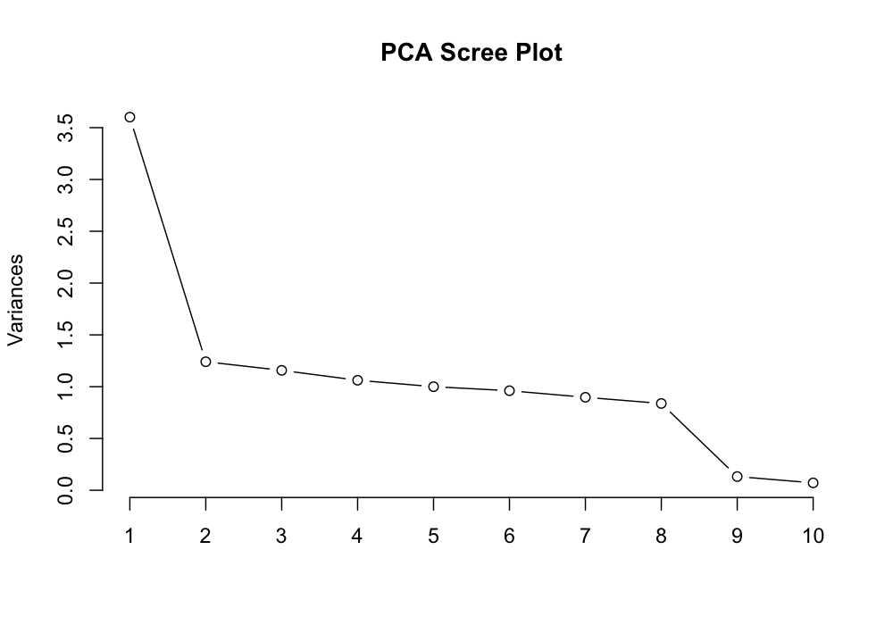
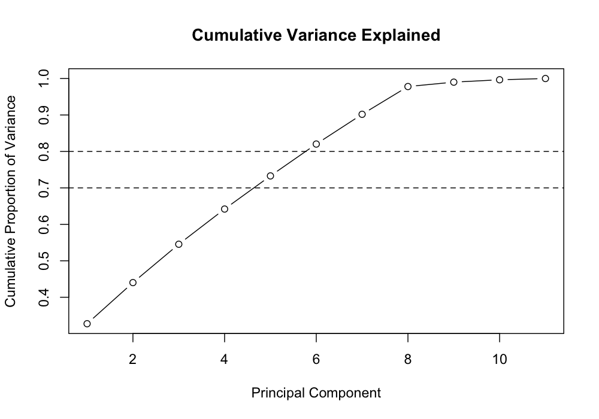
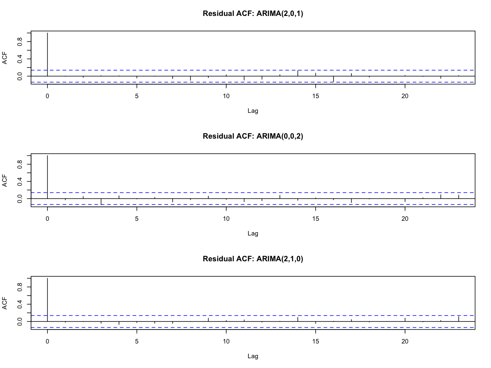

# Statistical & Insurance Risk Modelling in R

## Overview

This repository presents a portfolio adaptation of collaborative MSc Actuarial Science coursework covering four statistical modelling techniques in R:

- Exploratory factor analysis
- Copula modelling of insurance claims
- Principal component analysis (PCA)
- ARIMA time-series modelling

The project demonstrates multivariate analysis, dependence modelling, dimensionality reduction and time-series model selection across several datasets.

## Methods

### Factor Analysis

- Reverse-scored selected questionnaire items
- Constructed the correlation matrix
- Examined eigenvalues and cumulative variance
- Fitted a five-factor exploratory model
- Applied PROMAX rotation
- Calculated Bartlett factor scores

### Copula Modelling

- Modelled positive claim frequency using a Poisson marginal distribution
- Modelled positive claim severity using a lognormal marginal distribution
- Fitted Gaussian, Clayton and Gumbel copulas by maximum likelihood
- Compared fitted copulas using reported log-likelihoods

### Principal Component Analysis

- Standardised the input variables
- Applied PCA using `prcomp`
- Examined eigenvalues and cumulative variance explained
- Interpreted variable loadings
- Visualised observations using PC1 and PC2 with loading vectors

### ARIMA Modelling

- Inspected time plots, ACFs and PACFs
- Differenced a non-stationary series
- Compared candidate low-order ARIMA models using AIC
- Selected final models for three simulated time series
- Checked residual dependence using Ljung-Box tests and residual diagnostics

## Selected Findings

- The Gaussian copula achieved the highest reported log-likelihood among the three fitted copula families.
- Five principal components were retained, explaining **73.3%** of cumulative variance.
- Selected ARIMA models:
  - Series 1: **ARIMA(2,0,1)**
  - Series 2: **ARIMA(0,0,2)**
  - Series 3: **ARIMA(2,1,0)**

## Selected Visualisations

### PCA Scree Plot

The scree plot shows the relative contribution of the principal components and helps assess how many components should be retained.



### Cumulative Variance Explained

The cumulative variance plot shows how the proportion of total variability captured increases as additional principal components are retained. Five principal components were retained, explaining **73.3%** of cumulative variance.



### ARIMA Residual Diagnostics

Residual autocorrelation plots were used to assess whether the selected ARIMA models had adequately removed serial dependence from the three simulated time series.



## Repository Structure

```text
statistical-insurance-risk-modelling-r/
├── README.md
├── factor_analysis.R
├── copula_modelling.R
├── pca_analysis.R
├── arima_modelling.R
└── figures/
    ├── pca_scree_plot.png
    ├── pca_cumulative_variance.png
    ├── pca_score_loading_plot.png
    ├── arima_series_overview.png
    └── arima_residual_acf.png
